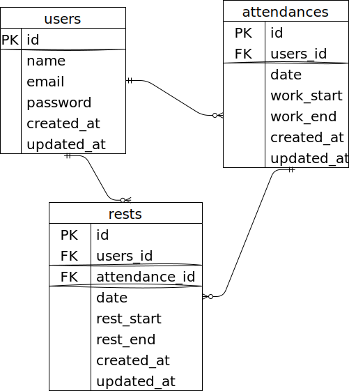

# **Atte(アット) -勤怠管理システム**
- Atte(アット)は勤怠管理システムです。クリック1つで勤務時間と休憩時間をデータ管理することが出来ます。仕事の効率化・打刻の徹底・実態とかけ離れない勤怠の記録を実現します。

## **作成した目的**
### **現状の問題**
#### 社員側
- 勤怠管理の徹底が出来ず、実際の労号時間との差異発生
#### 管理者側
- 個々の社員の労働時間や残業時間の把握、管理困難
### 解決策と目的
- 勤怠の入力を気軽に出来るシステムを導入することで、ここの勤怠管理が容易となり、管理者が正当な評価を実現する。

## **アプリケーションURL**
### ローカル環境
#### http://localhost

###  本番環境　
#### http://3.112.47.178
- ログインしていないユーザーの場合、ログインページを表示します。

## **他のリポジトリ**
- git@github.com:fujico23/atte-system.git　よりgit clone

## **機能一覧**
### 会員登録
- ページで新規ユーザー登録
- 会員登録と同時に入力したメールアドレス宛に確認メールが送信される認証機能
### ログインページ
- ログイン後、打刻ページへ遷移
- ログイン後のログアウト
### 打刻ページ
- 勤務開始(日を跨いだ時点で翌日の出勤操作に切り替える)
- 勤務終了(日を跨いだ時点で翌日の出勤操作に切り替える)。視覚的に分かりやすくする為、勤務終了ボタンを押すと背景色を変更する仕様を追加。
- 休憩開始(※1日で何度も休憩が可能)
- 休憩終了
- 各ボタンを押すと上部のデフォルトメッセージ（「○○さん、お疲れ様です！」）が変更される。
### 日付別ページ
- 日付別勤怠情報取得
- ページネーション(5件ずつ取得)
### ユーザー一覧ページ(社員一覧ページ)
- 権限のあるユーザーのみ社員一覧ページへ遷移できるように処理
- 各「名前」を押すことでユーザー毎の勤怠表が見られるページへ遷移
- 勤務状況の表示変更機能　※打刻ページで押されたボタンと連動。勤務開始：青色で「勤務中」、勤務終了：灰色で「退社」、どちらも押されていない：赤色で「勤務外」
### ユーザーごとの勤怠表が見られるページ（社員別ページ）
- 月毎に各社員の勤怠表が見られる
- EXPORTボタンを押すと月毎の社員勤怠表をCSVファイルでダウンロード出来る

## **使用技術(実行環境)**
- Laravel 8.x
- PHP 7.4.9-fpm
- MySQL 8.0.26
- nginx 1.21.1

## **Laravel環境構築**
- docker-compose up -d --build
- docker-compose exec php bash
- composer install
- .env.exampleファイルから.envを作成し、環境変数を変更
- php artisan key:generate
- php artisan migrate
- php artisan db:seed
- composer require laravel/fortify
- php artisan vendor:publish --provider="Laravel\Fortify\FortifyServiceProvider"

## **環境変数**
### 開発環境(ローカルマシーンにDockerで環境構築)
- APP_NAME=Atte

- DB_CONNECTION=mysql
- DB_HOST=mysql
- DB_PORT=3306
- DB_DATABASE=laravel_db
- DB_USERNAME=laravel_user
- DB_PASSWORD=laravel_pass

- MAIL_FROM_ADDRESS=test@example.co.jp

### 本番環境(AWS EC2,RDSインスタンスにて構築)

- DB_CONNECTION=mysql
- DB_HOST=mysql
- DB_PORT=3306
- DB_DATABASE=RDSのデータベース名に変更
- DB_USERNAME=RDSのユーザー名に変更
- DB_PASSWORD=RDSのパスワードに変更

- MAIL_MAILER=ses
- MAIL_HOST=email-smtp.ap-northeast-1.amazonaws.com
- MAIL_PORT=587
- MAIL_USERNAME=SESのSMTP認証情報から作成したIAMのSMTPユーザー名
- MAIL_PASSWORD=SESのSMTP認証情報から作成したIAMのSMTPパスワード
- MAIL_ENCRYPTION=tls
- MAIL_FROM_ADDRESS=SESで認証済みメールアドレス
- MAIL_FROM_NAME="${APP_NAME}"

- AWS_ACCESS_KEY_ID=SESのSMTP認証情報から作成したIAMで作成したアクセスキー
- AWS_SECRET_ACCESS_KEY=SESのSMTP認証情報から作成したIAMで作成したシークレットアクセスキー
- AWS_DEFAULT_REGION=ap-northeast-1

## **テーブル設計**

## **ER図**

## **他に記載することがあれば記述する**
### 社員一覧ページ(/list)へのアクセス権があるユーザー
#### 開発環境(docker)
- userid:1  メールアドレス：test1@exmple.com パスワード：11111111 ※メールアドレス認証済みの為、確認メールは送信されません
#### 本番感環境(AWS)
- userid:26 メールアドレス：k03c347b@yahoo.co.jp  パスワード：1111111111 ※メールアドレス認証済みの為、確認メールは送信されません

### 新規登録時にメールによって本人確認を行う機能について
#### 全体に於ける注意点
- MustVerifyEmailインターフェースを実装しているため、登録したメールアドレスに送られる確認メールで承認して初めてログインができます。
#### 開発環境(docker)での確認メール送信注意点
- 確認メール受信確認場所 Mailhog http://localhost:8025/
#### 本番環境(AWS)での確認メール送信注意点
- SESにて実装。「ドメイン取得はなし」案件の為、送信元は自身のメールアドレスにて実装。その為DKIM等の処理が出来ず、送信された確認メールが迷惑メールBOXに入っている可能性あり。gmailドメインで実装可能。キャリアメールでは送信出来ない可能性あり。

### スプレッドシート
- https://docs.google.com/spreadsheets/d/134UIND_PJuUtpdHXJVs666cPhtz6wKYsIt4mZlNVx5s/edit#gid=1135477369